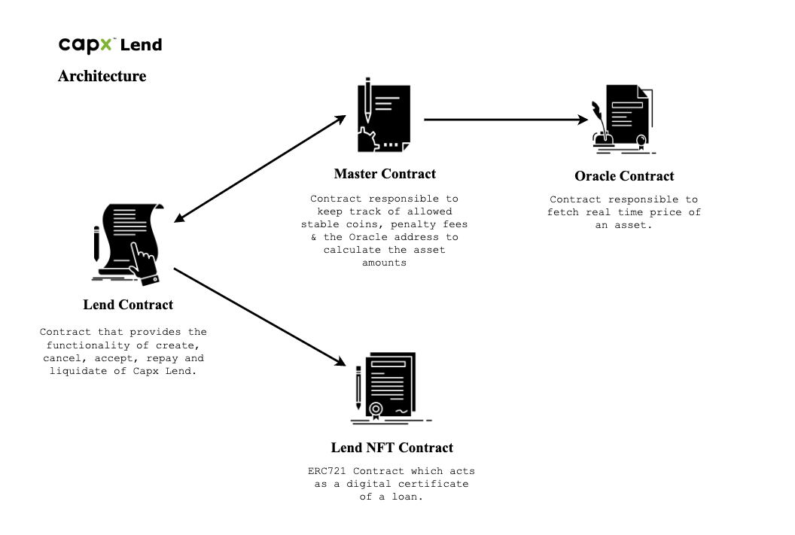
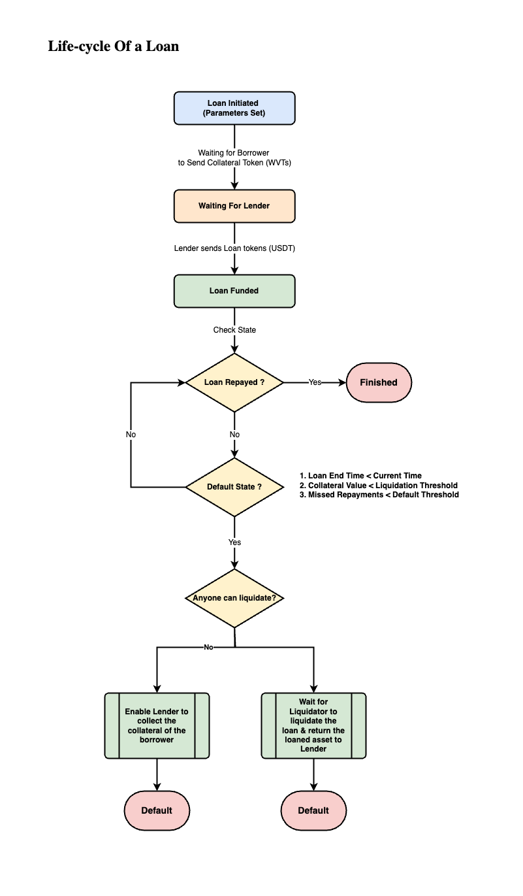
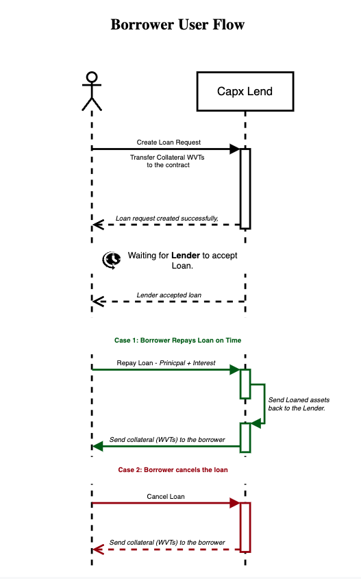
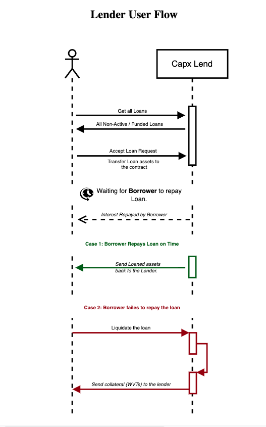

# Capx-Lend-Protocol
The project provides a decentralized platform allowing WVT holders to lend out their stable coins by keeping WVTs as collateral. <br />
Enabling WVT holders with the ability to get P2P loans from the blockchain community.

Architecture
-------------------


Deploying the Smart Contracts
================================

The deployment script is written in the migrations file "1_initial_migration".
This project has total of 4 contracts which are deployed in succession with multiple functions called in between.

## How to deploy a contract in migration files

Normal Deployment
```js
const instanceVariable = await deployer.deploy(contractVariable, contructorArguments)
```
Deployment with proxy
```js
const instanceVariable = await deployProxy(contractVariable, [args], { kind: 'uups' });

## Step 1

Importing the contracts

```javascript
const oracle = artifacts.require("Oracle");
const Master = artifacts.require("Master");
const LendNFT = artifacts.require("LendNFT");
const Lend = artifacts.require("Lend");
```

## Step 2 

Gets the accounts to be used for deployment

```javascript
const accounts = await web3.eth.getAccounts();
```

## Step 3

Deploys lendNFT contract using openzeppelin upgradable plugin. 

```javascript
let nftinstance = await deployProxy(LendNFT,[],{kind: 'uups'});
```

## Step 4

Deploys oracle contract using openzeppelin. 

```javascript
await deployer.deploy(oracle);
```

## Step 5

Deploys master contract using openzeppelin upgradable plugin. 

```javascript
let MasterInstance =  await deployProxy(Master, [oracleInstance.address,"500"], { kind: 'uups' });
```

## Step 6

Deploys lend contract using openzeppelin upgradable plugin. 

```javascript
let lendInstance = await deployProxy(Lend, [MasterInstance.address, nftinstance.address], { kind: 'uups' });
```

### Run Migrate to deploy the contracts.

`truffle migrate`

<br>

Implementation Details 
======================

### `Lend` contract

The Lend contract is the contract from which the user interacts with. This contract is responsible for lending, repayment and liquidation. For more details see [Lend.md](./docs/Lend.md)

### `Master` Contract

The Master contract is the contract from which the lend contract gets calculated values and conversion according to current market prices. For more details see [Master.md](./docs/Master.md)

### `Oracle` Contract

The Oracle contract is the contract from which the master contract fetch current prices for calculation. For more details see [Oracle.md](./docs/Oracle.md)

### `LendNFT` Contract

The LendNFT contract is the contract from which the lend contract uses to mint and burn lend NFTs which are essentially a proof of lend.

<br>

Lifecycle of Loan
===============


<br>

User Flows
===========
## Borrower

## Lender


